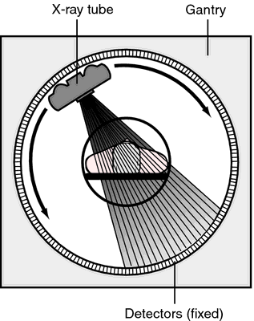

```{r, echo=FALSE}
knitr::opts_chunk$set(
  fig.align = "center",
  echo=FALSE
)
```


## Prelude {.smaller}

<iframe width="560" height="315" src="https://www.youtube.com/embed/Zdgw4S0GgL8" frameborder="0" allowfullscreen></iframe>

[[@han_integrated_2017]](https://doi.org/10.1016/j.cell.2016.12.027)
<!-- Optogenetics -->

## Today's topics

- Warm-up
- Wrap-up on structural measures
- Functional measures

# Warm-up

## This cell-staining technique has what kind of *spatial* resolution?

<div class="centered">
<a href="https://www.researchgate.net/profile/Michael_Mcdonald12/publication/273065942/figure/fig5/AS:654115122204675@1532964606922/Fresh-rat-brain-tissues-were-stained-with-classical-Golgi-or-Golgi-Cox-stain-Golgi.png">

</a>
</div>

## This cell-staining technique has what kind of *spatial* resolution?

- High/resolves fine details
- Low/resolves crude details

## This cell-staining technique has what kind of *spatial* resolution?

- **High/resolves fine details**
- ~~Low/resolves crude details~~

## This cell-staining technique has what kind of *temporal* resolution?

<div class="centered">
<a href="https://www.researchgate.net/profile/Michael_Mcdonald12/publication/273065942/figure/fig5/AS:654115122204675@1532964606922/Fresh-rat-brain-tissues-were-stained-with-classical-Golgi-or-Golgi-Cox-stain-Golgi.png">

</a>
</div>

## This cell-staining technique has what kind of *temporal* resolution?

- High/resolves fine details or quickly changing phenomena
- Low/resolves crude details or slowly changing phenomena

## This cell-staining technique has what kind of *temporal* resolution?

- ~~High/resolves fine details or quickly changing phenomena~~
- **Low/resolves crude details or slowly changing phenomena**

## The cell-staining technique in question is...

- A. Nissl stain
- B. Golgi stain
- C. Cartesian stain

## The cell-staining technique in question is...

- ~~A. Nissl stain~~
- **B. Golgi stain**
- ~~C. Cartesian stain~~

# Wrap-up on structural measures

<div class="centered">
<a href="https://media.springernature.com/lw685/springer-static/image/art%3A10.1038%2Fnn.3839/MediaObjects/41593_2014_Article_BFnn3839_Fig1_HTML.jpg?as=webp">

</a>

[Sejnowski 2014](http://doi.org/10.1038/nn.3839)
</div>

## Evaluating cellular tracing techniques

- Invasive (in humans post-mortem only)
- High spatial resolution, but poor temporal resolution
    - How so?

## Mapping structures

- Computed axial tomography (CAT), computed tomography [CT](https://en.wikipedia.org/wiki/CT_scan)
- X-ray based

## Tomography

<div class="centered">
<a href="https://img.tfd.com/mk/T/X2604-T-22.png">

</a>
</div>

## Tomography

<div class="centered">


<https://cdn.hswstatic.com/gif/cat-scan-pineapple.jpg>
</div>

## CT scan of stroke

<div class="centered">
<a href="https://1.bp.blogspot.com/-I5AIwDp1jJM/UF9gqPEw4vI/AAAAAAAB77M/VfLRw2JDEiY/s1600/mca+inferior+division+infarct+ct+brain.JPG">

</a>
</div>

## [Magnetic Resonance Imaging (MRI)](https://en.wikipedia.org/wiki/Magnetic_resonance_imaging)

- Magnetic resonance
- Some common isotopes (e.g., $H$) & complex molecules have a magnetic dipole
- Axes align with strong magnetic field
- When alignment perturbed by radio frequency (RF) pulse, speed of realignment varies by tissue
- Realignment emits RF signals

---

- [How MRI works](https://science.howstuffworks.com/mri.htm)
- Also, please watch: [Magnetic Resonance Imaging Explained](https://youtu.be/MiL0wCZr0Mw)

## How MRI works

<div class="centered">


<https://cdn.hswstatic.com/gif/mri-steps.jpg>
</div>

## <span class="blue">Structural</span> MRI

- vs. <span class="green">Functional</span> MRI
- Reveals tissue density/type differences
- [Gray matter](https://en.wikipedia.org/wiki/Grey_matter) (neurons & dendrites & axons & glia) vs. [white matter](https://en.wikipedia.org/wiki/White_matter) (mostly axons)
- MR Spectroscopy (density of specific chemical substances)
- Region sizes/volumes

## Structural MRI of the brain

<div class="centered">
<a href="https://med.nyu.edu/thesenlab/research-0/brain-morphometry/">

</a>
</div>

## [Diffusion tensor imaging (DTI)](https://en.wikipedia.org/wiki/Diffusion_MRI#Diffusion_tensor_imaging)

<div class="centered">

</div>

## [Diffusion tensor imaging (DTI)](https://en.wikipedia.org/wiki/Diffusion_MRI#Diffusion_tensor_imaging)

- Type of structural MRI
- Reveals integrity/density of *axon fibers*
- Measure of connectivity between brain areas
- Measures *diffusion* pattern of $H_{2}O$ molecules
- Shape of diffusion pattern captured in a *tensor*
- (Colors indicate closest-matching 'direction')

## [Voxel-based morphometry (VBM)](https://en.wikipedia.org/wiki/Voxel-based_morphometry)

- [Voxels (volume-based elements)](https://en.wikipedia.org/wiki/Voxel)
- Morphometry, measure ("metry") form/morphology.
- How does brain size or thickness vary by age, disease status, etc.?

## Voxel-based morphometry {.smaller}

<div class="centered">


<https://www.frontiersin.org/files/Articles/18691/fnhum-06-00184-HTML/image_m/fnhum-06-00184-g003.jpg>
</div>

## Colors mean *size* differences, not activity

<div class="centered">

</div>

# Functional methods

## Functional methods

- Recording from the brain 
- Interfering with the brain 
- Stimulating the brain
- Simulating the brain

## Recording from the brain

- Single/multi unit recording
    - Microelectrodes
    - Units -> Small numbers of nerve cells

## Single/multi-unit Recording {.smaller}

```{r, out.width="600px", fig.cap="[[@Maren2004-uz]](http://dx.doi.org/10.1038/nrn1535)"}
knitr::include_graphics("https://media.springernature.com/w300/springer-static/image/art%3A10.1038%2Fnrn1535/MediaObjects/41583_2004_Article_BFnrn1535_Figa_HTML.jpg?as=webp")
```

## Single/multi-unit recording

- What does neuron X respond to?
- High temporal (ms) & spatial resolution (um)
- Invasive
- Rarely suitable for humans, but...

## [Electrocorticography (ECoG)](https://en.wikipedia.org/wiki/Electrocorticography)

<div class="centered">
<a href="https://sites.uci.edu/alns/files/2015/03/eCOG-stock-photo-22578962-brain-surgery.jpg">

</a>
</div>

## ECoG and multimodal brain imaging

<https://youtu.be/gFky09ekmzw>

## [Positron Emission Tomography (PET)](https://en.wikipedia.org/wiki/Positron_emission_tomography)

<iframe width="560" height="315" src="https://www.youtube.com/embed/GHLBcCv4rqk" frameborder="0" allowfullscreen></iframe>

## [Positron Emission Tomography (PET)](https://en.wikipedia.org/wiki/Positron_emission_tomography)

- Radioactive tracers (glucose, oxygen)
- Positron decay
- Experimental condition - control
- Average across individuals

---

<div class="centered">

</div>

<div class="notes">
PET can be used to look at differences in brain activation in different, but related tasks.
</div>

## Evaluating PET

+ Temporal (~ s) and spatial (mm-cm) resolution *worse* than fMRI
+ Radioactive exposures + mildly invasive 
+ Dose < airline crew exposure in 1 yr

## [Functional Magnetic Resonance Imaging (fMRI)](https://en.wikipedia.org/wiki/Functional_magnetic_resonance_imaging)

- Neural activity -> local $O_2$ consumption increase
- <span class="blue">*Blood Oxygen Level Dependent (BOLD) response*</span>
    + Oxygenated vs. deoxygenated hemoglobin creates magnetic contrast
    + Do regional blood $O_2$ volumes (and flow) vary with behavior X?
    
## fMRI

<div class="centered">
<a href="https://www.cmu.edu/news/stories/archives/2013/june/images/happysadbrainactivity_400x200.jpg">

</a>
</div>

## fMRI [[@dougherty_visual_2003]](https://doi.org/10.1167/3.10.1)

<div class="centered">
<a href="https://doi.org/10.1167/3.10.1">

</a>
</div>

---

<iframe width="560" height="315" src="https://www.youtube.com/embed/rsykP-9-moA" title="YouTube video player" frameborder="0" allow="accelerometer; autoplay; clipboard-write; encrypted-media; gyroscope; picture-in-picture" allowfullscreen></iframe>

---

<iframe width="560" height="315" src="https://www.youtube.com/embed/DcgHJIlwQCo" title="YouTube video player" frameborder="0" allow="accelerometer; autoplay; clipboard-write; encrypted-media; gyroscope; picture-in-picture" allowfullscreen></iframe>

## Evaluating fMRI

+ Non-invasive, but expensive
+ Moderate but improving (mm) spatial, temporal (~sec) resolution
+ **Indirect** measure of brain activity
- [Hemodynamic Response](https://en.wikipedia.org/wiki/Haemodynamic_response) Function (HRF)
    + 1s delay plus 3-6 s 'initial-dip'

## [Hemodynamic Response](https://en.wikipedia.org/wiki/Haemodynamic_response) Function (HRF)

<div class="centered">
<a href="https://openi.nlm.nih.gov/imgs/512/236/3109590/3109590_TONIJ-5-24_F1.png">

</a>
</div>

## [Electroencephalography (EEG)](https://en.wikipedia.org/wiki/Electroencephalography)

- How does it work?
    - Electrodes on scalp or brain surface
- What do we measure?
    - Combined activity of huge # of neurons

## EEG

<div class="centered">
<a href="https://i.imgur.com/ZrmxJRu.jpg">

</a>
</div>

## EEG

- High/fine temporal resolution but poor spatial resolution
- Analyze frequency bands
    + LOW: deep sleep
    + MIDDLE: Quiet, alert state
    + HIGH:“Binding” information across senses
  
## EEG Frequency

<div class="centered">
<a href="https://i.stack.imgur.com/epLsO.png">

</a>
</div>

## [Event-related potentials (ERPs)](https://en.wikipedia.org/wiki/Event-related_potential)

- EEGs time-locked to some event 
- Averaged over many trials

## ERPs

<div class="centered">
<a href="https://2.bp.blogspot.com/_2ob-1_LsjJs/TAUjw9i_dYI/AAAAAAAAAQQ/9AfiHsnD-P8/s1600/ERP_technique.gif">

</a>
</div>

## [Brain Computer Interface (BCI)](https://computer.howstuffworks.com/brain-computer-interface.htm) {.smaller}

<div class="centered">


<https://cdn.hswstatic.com/gif/brain-computer-interface-3.gif>
</div>

## [Magneto-encephalography (MEG)](https://en.wikipedia.org/wiki/Magnetoencephalography)

- Like EEG, but measuring magnetic fields
- High temporal resolution, low spatial resolution
- Magnetic field propagates w/o distortion

## MEG

<div class="centered">
<a href="https://upload.wikimedia.org/wikipedia/commons/thumb/e/e6/NIMH_MEG.jpg/580px-NIMH_MEG.jpg">

</a>
</div>

## Manipulating the brain

- Nature’s “experiments”
    + Stroke, head injury, tumor
    + Neuropsychology
- If damage to X impairs performance on Y -> X critical for/controls Y
- Poor spatial/temporal resolution, limited experimental control

## [Phineas Gage](https://en.wikipedia.org/wiki/Phineas_Gage) {.flexbox .vcenter .smaller}

```{r, out.height="500px", fig.align='center', fig.cap="http://www.doctorsimpossible.com/the-curious-case-of-phineas-gage/"}
knitr::include_graphics("http://www.doctorsimpossible.com/wp-content/uploads/2017/11/Phineas-Gage-with-skull-picture.png")
```

---

```{r, out.height="550px"}
knitr::include_graphics("https://upload.wikimedia.org/wikipedia/en/9/98/The_Man_Who_Mistook_His_Wife_for_a_Hat_cover.jpg")
```

## Stimulating the brain

- Pharmacological
- Electrical ([transcranial Direct Current Stimulation - tDCS](https://en.wikipedia.org/wiki/Transcranial_direct-current_stimulation))
- Magnetic (Transcranial magnetic stimulation - *TMS*)
- Optically (optogenetics)

## tDCS {.smaller}

```{r, fig.cap="[[@Dayan2013-gp]](http://www.nature.com/neuro/journal/v16/n7/full/nn.3422.html)", out.width="600px"}
knitr::include_graphics("https://media.springernature.com/full/springer-static/image/art%3A10.1038%2Fnn.3422/MediaObjects/41593_2013_Article_BFnn3422_Fig4_HTML.jpg?as=webp")
```

## TMS {.smaller}

```{r, fig.cap="[[@Dayan2013-gp]](http://www.nature.com/neuro/journal/v16/n7/full/nn.3422.html)", out.width="600px"}
knitr::include_graphics("https://media.springernature.com/full/springer-static/image/art%3A10.1038%2Fnn.3422/MediaObjects/41593_2013_Article_BFnn3422_Fig1_HTML.jpg?as=webp")
```

## [Optogenetic](https://en.wikipedia.org/wiki/Optogenetics) stimulation

<iframe width="560" height="315" src="https://www.youtube.com/embed/I64X7vHSHOE?list=PLRstm0n591-rBbOeC0SJEy20-NwXpLo4G" frameborder="0" allowfullscreen></iframe>

## Evaluating stimulation methods

- Spatial/temporal resolution?
    + Does stimulation mimic natural activity?
    + Optogenetic stimulation highly similar, others less so
- Deep brain stimulation as therapy
    + Parkinson’s Disease 
    + Depression 
    + Epilepsy

## [Deep brain stimulation](https://en.wikipedia.org/wiki/Deep_brain_stimulation) {.smaller}

```{r, fig.cap="https://www.nimh.nih.gov/health/topics/brain-stimulation-therapies/brain-stimulation-therapies", out.height="400px"}
knitr::include_graphics("https://www.nimh.nih.gov/sites/default/files/images/health-and-outreach/mental-health-topic-brain-stimulation-therapies/vns-200.jpg")
```

---

<iframe width="560" height="315" src="https://www.youtube.com/embed/KDjWdtDyz5I" frameborder="0" allowfullscreen></iframe>

<div class="notes">
Effects of DBS for Parkinson's.
</div>

## *Sim*ulating the brain

- Computer/mathematical models of brain function
- Example: neural networks
- Cheap, noninvasive, can be stimulated or “lesioned”

---

<div class="centered">

</div>

<div class="notes">
Convolutional neural network.
</div>

## Spatial and Temporal Resolution {.smaller}

```{r, out.width="600px", fig.cap="[[@sejnowski2014putting]](https://doi.org/10.1038/nn.3839)"}
knitr::include_graphics("https://media.springernature.com/lw685/springer-static/image/art%3A10.1038%2Fnn.3839/MediaObjects/41593_2014_Article_BFnn3839_Fig1_HTML.jpg?as=webp")
```

## Next time...

- Brain anatomy (through song & dance)

## References {.smaller}
